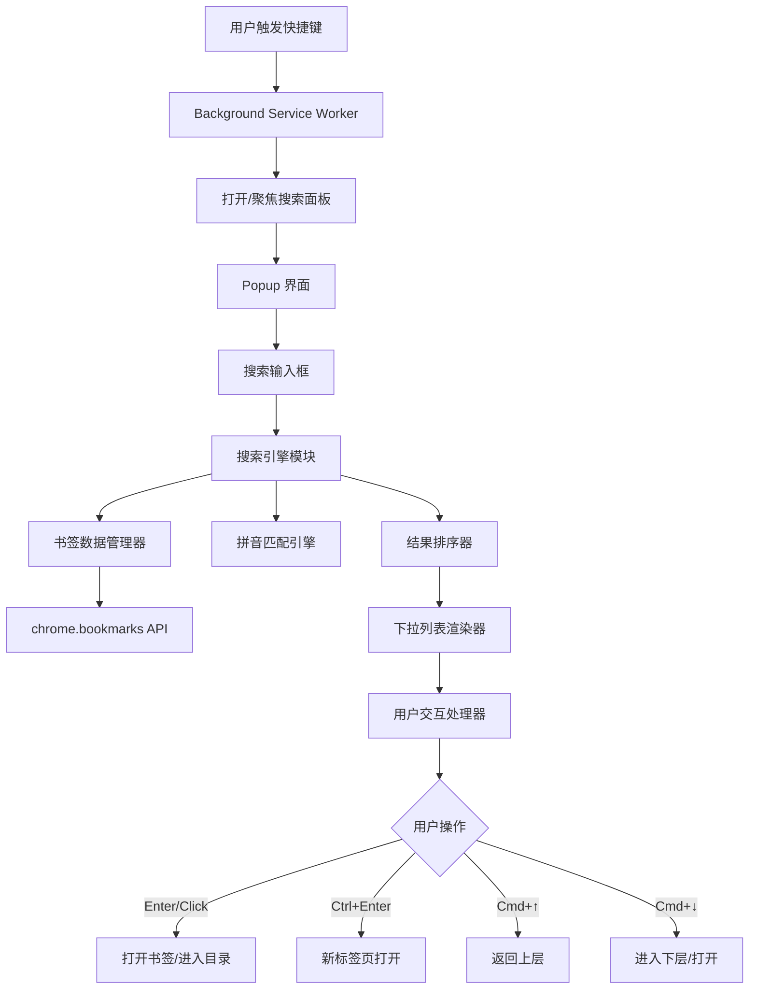
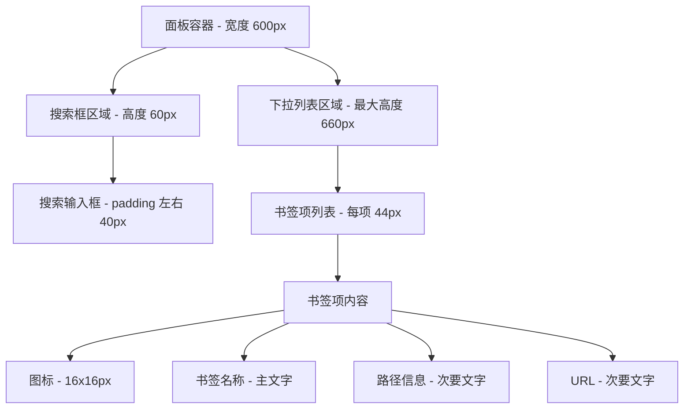

# Chrome 书签快捷搜索插件设计文档

## 1. 需求概述

### 1.1 功能目标
提升用户浏览器书签访问效率，通过快捷键唤起搜索面板，实现快速查找和访问书签，避免在书签栏中逐层点击的繁琐操作。

### 1.2 核心价值
- 提高书签访问效率，减少操作步骤
- 提供类似 Spotlight 的流畅搜索体验
- 支持智能搜索和层级导航
- 提供便捷的键盘操作方式

## 2. 技术架构设计

### 2.1 技术选型

| 技术项 | 选型方案 | 说明 |
|--------|---------|------|
| Manifest 版本 | Manifest V3 | Chrome 插件最新标准,向后兼容性更好 |
| 核心语言 | 原生 JavaScript | 轻量级,无框架依赖 |
| UI 结构 | HTML + CSS | 简洁高效的界面构建 |
| 书签 API | chrome.bookmarks | Chrome 提供的书签访问接口 |
| 快捷键 API | chrome.commands | 全局快捷键监听 |
| 拼音处理 | pinyin-pro 第三方库 | 支持完整汉字拼音转换、多音字处理、首字母和全拼匹配 |
| 图标服务 | Google Favicon API | 网站图标获取服务(https://www.google.com/s2/favicons) |

### 2.2 架构组件



### 2.3 模块职责划分

| 模块名称 | 文件位置 | 核心职责 |
|---------|---------|---------|
| 配置清单 | manifest.json | 定义插件元信息、权限、快捷键、入口页面 |
| 后台服务 | background.js | 监听快捷键事件、管理面板打开/关闭状态 |
| 界面结构 | popup.html | 定义搜索面板的 DOM 结构 |
| 界面交互 | popup.js | 处理用户输入、键盘事件、界面更新、焦点管理 |
| 搜索引擎 | filter.js | 实现搜索逻辑、拼音匹配、结果排序、层级匹配算法 |
| 书签管理 | bookmarkManager.js | 书签数据获取、缓存、路径解析、拼音预处理 |
| 拼音工具 | pinyinUtil.js | 汉字拼音转换、拼音匹配算法、混合输入处理 |
| 样式表 | popup.css | Spotlight 风格的视觉样式 |

## 3. 界面设计

### 3.1 视觉风格

参考 macOS Spotlight 设计风格：

| 设计元素 | 设计方案 |
|---------|---------|
| 面板背景 | 半透明磨砂效果（rgba(255, 255, 255, 0.95)） |
| 面板边框 | 1px 浅灰色边框，圆角 8px |
| 阴影效果 | box-shadow: 0 10px 40px rgba(0, 0, 0, 0.3) |
| 搜索框背景 | 纯白色，底部 1px 分隔线 |
| 搜索框字体 | 18px，系统默认字体 -apple-system, BlinkMacSystemFont |
| 下拉项高度 | 44px，适合点击和视觉扫描 |
| 选中项背景 | 淡蓝色高亮（rgba(0, 122, 255, 0.1)） |
| 文字颜色 | 主文字 #333，次要文字 #999 |
| 图标大小 | 16x16px，左侧对齐 |

### 3.2 布局结构



### 3.3 下拉列表项展示规则

每个书签项展示的信息结构：

| 信息类型 | 展示位置 | 样式说明 |
|---------|---------|---------|
| 图标 | 最左侧，距左边距 12px | 文件夹图标或网站 favicon，16x16px |
| 书签名称 | 图标右侧，距图标 8px | 字号 14px，颜色 #333，粗体 |
| 路径信息 | 名称下方 | 字号 12px，颜色 #999，格式：首页 > 学习 > 读书 |
| URL | 路径右侧或下方（视宽度而定） | 字号 12px，颜色 #999，超出截断显示... |

图标获取策略:
- 文件夹:使用固定的文件夹图标(Base64 编码的 SVG)
- 书签:使用 Google Favicon 服务获取网站图标
  - 服务地址:`https://www.google.com/s2/favicons?domain={hostname}&sz=32`
  - 提取 URL 的 hostname 作为域名参数
  - 使用内存级缓存优化性能,避免重复请求
  - 预加载机制:在面板打开时后台构建所有书签的图标 URL 缓存
- 降级方案:若 favicon 加载失败(通过 img onerror 事件),使用默认书签图标
- 注意事项:不使用 `chrome://favicon/` 协议(会触发浏览器安全限制错误)

## 4. 搜索功能设计

### 4.1 搜索输入规则

#### 4.1.1 允许的字符

| 字符类型 | 规则 |
|---------|------|
| 文字内容 | 支持中文、英文字母、数字 |
| 空格 | 允许，表示层级分隔 |
| 斜杠 / | 允许，表示精确路径导航 |
| 连字符 - | 允许，支持网站名称中的连字符 |
| 下划线 _ | 允许，支持标识符命名 |
| 点号 . | 允许，支持域名和文件扩展名 |
| 括号 ( ) [ ] { } | 允许，支持分类标签和注释 |
| 其他符号 | 不允许输入或自动过滤 |

#### 4.1.2 连续字符处理

| 场景 | 处理策略 |
|------|---------|
| 连续多个空格 | 实时替换为单个空格（输入时触发） |
| 连续多个斜杠 | 实时替换为单个斜杠（输入时触发） |
| 粘贴包含连续字符 | 粘贴后自动清理，保留单个 |
| 危险字符过滤 | 自动移除引号、尖括号、反斜杠、分号、冒号等 |
| 特殊符号保留 | 保留连字符、下划线、点号、括号等合法符号 |

### 4.2 搜索模式分类

#### 4.2.1 模式一：默认模式（搜索框为空）

触发条件：搜索框内容 trim 后为空字符串

行为：展示所有二级书签项目（书签栏下的直接子项，即深度为 2 的项目）

#### 4.2.2 模式二：模糊搜索模式

触发条件：搜索框包含文字和空格，不包含斜杠

语法规则：
- 空格作为层级分隔符
- 每个层级关键词都使用完整的匹配算法（拼音、非连续字符等）
- 关键词按顺序匹配路径层级，支持跳跃式匹配
- 末尾带空格表示获取匹配项的直接子项

示例说明：

| 搜索内容 | 匹配规则 | 返回结果 |
|---------|---------|---------|
| "学习 读书" | 上层某级目录匹配"学习"，当前或下层匹配"读书" | 匹配到的"读书"目录或书签 |
| "学习 读书 " | 上层匹配"学习"，下层匹配"读书" | "读书"目录的所有直接子项 |
| "前端 vue react" | 上层匹配"前端"，中间某层匹配"vue"，当前或下层匹配"react" | 符合路径关系的"react"相关项 |
| "我学习 读书" | 支持非连续汉字匹配，上层匹配"我学习"，当前或下层匹配"读书" | 匹配到的"读书"目录或书签 |
| "w学xi dsly" | 支持拼音汉字混合输入，上层匹配"我学习"，当前或下层匹配"读书乐园" | 匹配到的"读书乐园"目录或书签 |

#### 4.2.3 模式三：路径导航模式

触发条件：搜索框以斜杠开头

语法规则：
- 必须以 / 开头
- / 不能出现在任何空格之后
- 斜杠分隔的每一段表示精确目录名称
- 可以与空格搜索混合使用

示例说明：

| 搜索内容 | 匹配规则 | 返回结果 |
|---------|---------|---------|
| "/学习/课程" | 精确匹配路径"学习">"课程" | "课程"目录的所有直接子项 |
| "/学习/课程 语文" | 精确路径"学习">"课程"下模糊搜索 | "课程"下所有子孙层级中匹配"语文"的项 |
| "学习 /课程" | 不合法（/ 在空格后） | 无匹配结果（返回空列表） |
| "学习/课程" | 不合法（不以 / 开头） | 无匹配结果（返回空列表） |
| "/学习/课程/" | 精确匹配路径并以斜杠结尾 | "课程"目录的所有直接子项 |

### 4.3 匹配算法设计

#### 4.3.1 精确匹配（针对斜杠路径）

处理流程：
1. 解析斜杠分隔的路径段
2. 从书签根目录开始逐层匹配
3. 每一段必须与目录名称完全一致（大小写不敏感）
4. 返回最终路径定位的目录节点

#### 4.3.2 模糊匹配（针对文字内容）

匹配目标优先级：
1. **书签名称匹配**：优先与书签名称进行匹配
2. **URL 匹配**：其次与书签 URL 进行匹配

书签名称匹配策略：

| 匹配类型 | 匹配逻辑 | 优先级 | 分数 |
|---------|---------|--------|---------|
| 完全匹配 | 搜索词与书签名完全相同 | 最高 | 10 |
| 前缀匹配 | 书签名以搜索词开头 | 高 | 8 |
| 包含匹配 | 书签名包含搜索词 | 中 | 5 |
| 拼音匹配 | 拼音首字母或全拼匹配 | 低 | 3 |
| 非连续匹配 | 支持跳跃式汉字匹配 | 低 | 3 |

URL 匹配策略：

| 匹配类型 | 匹配逻辑 | 优先级 | 分数 |
|---------|---------|--------|---------|
| 域名完全匹配 | 搜索词与域名完全相同 | 高 | 6 |
| 域名包含匹配 | 域名包含搜索词 | 中 | 4 |
| URL 路径匹配 | URL 路径部分包含搜索词 | 低 | 2 |

匹配逻辑：
- 先对书签名称进行匹配，记录名称匹配分数
- 再对 URL 进行匹配，记录 URL 匹配分数
- 取两者中的最高分作为该项的匹配类型分
- 若书签名称和 URL 都匹配，优先使用书签名称的匹配分数

层级匹配算法：
- 采用分层独立匹配策略，将多关键词匹配转变为逐层匹配过程
- 每一层使用完整的拼音匹配算法（复用 matchText）
- 所有层级得分加权求和，得到最终匹配得分
- 支持跳跃式匹配（关键词数量 < 路径层级）

#### 4.3.3 拼音匹配规则

输入内容包含字母时的处理：

匹配规则：
- 按顺序匹配汉字拼音
- 支持全拼和首字母混合
- 可以跳过部分字符（少），但不能多或错位
- 大小写不敏感

示例说明：

| 输入 | 目标 | 匹配结果 | 说明 |
|------|------|---------|------|
| woaxxi | 我爱学习 | ✓ 匹配 | 完整拼音首字母 |
| wo | 我爱学习 | ✓ 匹配 | 匹配"我"的全拼 |
| woai | 我爱学习 | ✓ 匹配 | 混合匹配"我"全拼+"爱"首字母 |
| aiwxx | 我爱学习 | ✗ 不匹配 | 错位，"爱"应在"我"之后 |
| woaxxa | 我爱学习 | ✗ 不匹配 | 多了字符"a" |
| wxxx | 我爱学习 | ✓ 匹配 | 首字母匹配 |

拼音匹配实现策略：
- 使用 `pinyin-pro` 库进行汉字转拼音（支持全汉字、多音字、生僻字）
- 预处理书签名称，生成拼音数据（首字母和全拼）
- 支持多种匹配模式：
  - **全拼匹配**：完整拼音包含搜索词
  - **首字母匹配**：拼音首字母包含搜索词
  - **顺序匹配**：允许跳过字符的序列匹配
  - **非连续汉字匹配**：跳跃式汉字匹配（如 "我学" 匹配 "我爱学习"）
  - **混合输入匹配**：拼音与汉字混合输入（如 "w学xi" 匹配 "我爱学习"）
- 智能分段识别：自动拆分输入为拼音段、汉字段和其他字符段
- 计算匹配度分数，用于排序

### 4.4 匹配度评分规则

**综合评分因素**(实际实现):

#### 单关键词匹配评分(`matchAndScore()` 函数)

```javascript
matchScore = match.score * 0.5 + calculateDepthScore(bookmark.depth)
```

| 评分维度 | 权重 | 计算方式 | 实现说明 |
|---------|------|---------|----------|
| 匹配类型分 | 50% | `match.score * 0.5` | 来自 `matchBookmark()` 的得分 |
| 层级深度分 | 100% | `Math.max(0, 10 - depth)` | 深度越小分数越高 |

#### 多关键词层级匹配评分(`matchHierarchy()` 函数)

```javascript
matchScore = titleScore * 0.5 + pathTotalScore + depthScore
```

| 评分维度 | 权重 | 计算方式 | 实现说明 |
|---------|------|---------|----------|
| 当前项匹配 | 50% | `currentMatch.score * 0.5` | 最后一个关键词匹配书签名称/URL |
| 路径匹配 | 100% | `pathMatchResult.totalScore` | 所有路径层级的加权得分之和 |
| 层级深度分 | 100% | `Math.max(0, 10 - depth)` | 深度越小分数越高 |

#### 路径层级评分详情(`matchPathHierarchy()` 函数)

每一层的加权得分计算:
```javascript
weightFactor = 1.0 - (distanceFromEnd / parentPath.length) * 0.3
layerScore = bestMatch.score * weightFactor + baseScore(20)
totalScore += layerScore
```

**权重说明**:
- 距离书签越近的层级权重越高(weightFactor 范围: 0.7 ~ 1.0)
- 基础分数: 每层匹配成功额外加 20 分
- 层级匹配得分 = 匹配类型分 × 权重系数 + 基础分

**匹配类型基础分数表**:

| 匹配类型 | 书签名称分数 | URL分数 | 说明 |
|---------|------------|--------|------|
| 完全匹配 | 10 | 6 | text === keyword / domain === keyword |
| 前缀匹配 | 8 | - | text.startsWith(keyword) |
| 包含匹配 | 5 + coverage*2 | 4 | text.includes(keyword) / domain.includes(keyword) |
| 非连续匹配 | 4 + 覆盖率 + 连续性 | - | 跳跃式字符匹配 |
| URL路径匹配 | - | 2 | url.includes(keyword) |
| 拼音匹配 | 3 + (score/100)*multiplier | - | 全拼、首字母、混合等 |

**最大结果数量限制**: 15 条 (`MAX_RESULTS = 15`)

**排序规则**: 按 `matchScore` 降序排列

### 4.5 结果展示规则

| 规则项 | 设定 |
|--------|------|
| 最大展示数量 | 15 条 |
| 排序规则 | 按匹配度评分降序排列 |
| 无匹配结果 | 不显示下拉列表，仅保留空搜索框 |
| 默认选中 | 第一项默认高亮选中 |

## 5. 键盘交互设计

### 5.1 快捷键定义

| 快捷键 | 适用系统 | 功能 |
|--------|---------|------|
| Ctrl + K | Windows/Linux | 打开搜索面板 |
| Command + K | macOS | 打开搜索面板 |

快捷键配置：
- 在 manifest.json 的 commands 中定义
- 设置为全局快捷键，浏览器任意界面可触发
- 若面板已打开，重复按快捷键应聚焦搜索框

### 5.2 面板内键盘操作

**实际支持的键盘操作**(基于 `popup.js` 的 `handleKeyDown()` 函数):

| 按键 | 功能 | 详细说明 | 实现位置 |
|------|------|---------|----------|
| ↑ | 向上选择 | 高亮上一个下拉项,若已在第一项则循环到最后一项 | `moveSelection(-1)` |
| ↓ | 向下选择 | 高亮下一个下拉项,若已在最后一项则循环到第一项 | `moveSelection(1)` |
| Cmd/Ctrl + ↑ | 返回上层路径 | 删除搜索框最后一个词及其前导符(/ 或空格),触发搜索更新 | `navigateUp()` |
| Cmd/Ctrl + ↓ | 进入目录/后台打开 | 若选中项为目录,进入该目录;若为书签,在新标签页后台打开,面板保持打开 | `navigateDown()` |
| Cmd/Ctrl + ← | 跳转到第一项 | 将选中索引设置为 0 | `jumpToFirst()` |
| Cmd/Ctrl + → | 跳转到最后一项 | 将选中索引设置为 length-1 | `jumpToLast()` |
| Enter | 确认操作 | 若选中项为目录,进入该目录;若为书签,在新标签页打开并切换,面板关闭 | `openSelectedItem(true, true)` |
| Ctrl/Cmd + Enter | 后台打开书签 | 仅对书签有效,在新标签页后台打开(不切换),当前标签页和面板保持不变,搜索内容保留 | `openSelectedItem(false, false)` |
| Esc | 关闭面板 | 关闭搜索面板,不清空搜索内容(保存状态) | `window.close()` |
| Cmd/Ctrl + Backspace | 清空搜索框 | 快速清空搜索框内容,触发默认模式(显示二级书签) | `searchInput.value = ''; performSearch('')` |

**按键处理优先级**:
1. 优先处理 Cmd/Ctrl 组合键,避免与普通方向键冲突
2. 使用 `e.preventDefault()` 阻止默认行为
3. 使用 `return` 明确退出,防止执行后续逻辑

**键盘操作注意事项**:
- Mac 系统检测: `navigator.platform.toUpperCase().indexOf('MAC') >= 0`
- Mac 使用 `e.metaKey`,其他系统使用 `e.ctrlKey`
- 循环选择: 第一项向上 → 最后一项, 最后一项向下 → 第一项
- 滚动跟随: 选中项变化时自动滚动到可见区域 `scrollIntoView({ block: 'nearest', behavior: 'smooth' })`

### 5.3 交互行为说明

#### 5.3.1 进入目录的行为

**触发方式**:
- Enter 键(选中目录时)
- Command/Ctrl + ↓(选中目录时)
- 鼠标单击目录项

**行为效果**(实际实现):
- 搜索框内容变更为该目录的完整路径表示
- 使用文件夹对象的 `path` 数组构建路径字符串
- 过滤空值: `folder.path.filter(p => p && p.trim() !== '')`
- 路径格式: `'/' + validPath.join('/')`
- 保留所有有效层级,包括一级目录(书签栏、其他书签等)
- 下拉列表自动更新为该目录的直接子项
- 使用 `setTimeout()` 确保 DOM 渲染完成后恢复焦点到搜索框

**示例流程**:
1. 初始状态:搜索框为空,展示二级项目
2. 选中"学习"目录,按 Enter
3. 搜索框变为:"/书签栏/学习"(包含完整路径)
4. 下拉列表展示"学习"目录的所有直接子项
5. 继续选中"课程"目录,按 Enter
6. 搜索框变为:"/书签栏/学习/课程"
7. 下拉列表展示"课程"目录的所有直接子项
8. 每次进入后焦点自动恢复到搜索框

#### 5.3.2 返回上层的行为

触发方式：Command/Ctrl + ↑

行为效果：
- 正确实现路径回退算法：
  - 去除末尾的所有连续分隔符
  - 从处理后的字符串末尾向前查找第一个分隔符
  - 截取到该分隔符的位置（不含分隔符）
- 触发搜索逻辑，更新下拉列表

示例流程：

| 当前搜索框内容 | 按 Cmd+↑ 后 | 下拉列表变化 |
|---------------|-------------|-------------|
| "/学习/课程" | "/学习" | 展示"学习"的子项 |
| "/学习" | "" | 展示所有二级项目 |
| "学习 读书 " | "学习 " | 展示匹配"学习"的项的子项 |
| "学习 读书" | "学习 " | 展示匹配"学习"的项的子项 |
| "学习" | "" | 展示所有二级项目 |
| "/学习/读书/语文" | "/学习/读书" | 展示"读书"的子项 |

#### 5.3.3 打开书签的行为

触发方式及效果：

| 触发方式 | 打开方式 | 标签页切换 | 面板状态 | 搜索内容 |
|---------|---------|-----------|---------|---------|
| Enter 键 | 新标签页打开 | 切换到新标签页 | 关闭 | 清空 |
| 鼠标单击 | 新标签页打开 | 切换到新标签页 | 关闭 | 清空 |
| Ctrl + Enter | 新标签页后台打开 | 停留在当前标签页 | 保持打开 | 保留 |
| Ctrl + 鼠标单击 | 新标签页后台打开 | 停留在当前标签页 | 保持打开 | 保留 |
| Command/Ctrl + ↓ | 新标签页后台打开 | 停留在当前标签页 | 保持打开 | 保留 |

核心交互逻辑：
- **Enter / 鼠标单击**：适用于打开单个书签后直接浏览的场景，打开后自动切换到新标签页，面板关闭
- **Ctrl + Enter / Ctrl + 单击**：适用于批量打开多个书签的场景，保持在当前标签页和插件面板状态，可连续点击打开多个书签，避免重复打开面板和搜索
- **Command/Ctrl + ↓**：键盘快捷方式，行为与 Ctrl + Enter 一致，便于键盘用户快速操作

注意事项：
- 选中项为目录时，所有打开操作均变为进入目录，不打开新标签页
- Ctrl + Enter 和 Ctrl + 单击时，新标签页在后台打开（inactive 模式），当前标签页保持激活状态
- 后台打开书签后，焦点保持在搜索框，便于连续操作
- 使用 chrome.tabs.create({ url, active: false }) 实现后台打开

### 5.4 焦点管理规则

| 场景 | 焦点行为 |
|------|---------|
| 面板打开时 | 自动聚焦到搜索输入框 |
| 面板已打开再次触发快捷键 | 重新聚焦到搜索输入框 |
| 使用方向键选择 | 焦点保持在搜索框，通过高亮显示选中项 |
| Ctrl + Enter 后台打开书签 | 当前标签页和焦点不变,保持在搜索框 |
| Enter 打开书签 | 面板关闭,焦点切换到新打开的标签页 |
| Ctrl + 单击后台打开书签 | 当前标签页和焦点不变,保持在搜索框 |
| 单击打开书签 | 面板关闭,焦点切换到新打开的标签页 |
| 进入文件夹后 | 自动恢复焦点到搜索框，确保用户可连续操作 |

## 6. 数据管理设计

### 6.1 书签数据获取

数据来源：chrome.bookmarks API

核心方法：

| API 方法 | 用途 |
|---------|------|
| chrome.bookmarks.getTree() | 获取完整书签树结构 |
| chrome.bookmarks.get(id) | 根据 ID 获取特定书签节点 |
| chrome.bookmarks.getChildren(id) | 获取指定节点的子项 |

### 6.2 书签数据结构

Chrome 书签节点属性：

| 属性名 | 类型 | 说明 |
|--------|------|------|
| id | string | 书签唯一标识符 |
| title | string | 书签或文件夹名称 |
| url | string | 书签 URL（文件夹无此属性） |
| dateAdded | number | 创建时间戳 |
| parentId | string | 父节点 ID |
| children | array | 子节点列表（仅文件夹有） |
| index | number | 在父节点中的位置 |

### 6.3 数据预处理策略

为提高搜索性能，需对书签数据进行预处理：

预处理任务：

| 任务 | 目的 | 处理内容 |
|------|------|---------|
| 路径计算 | 快速展示路径信息 | 为每个节点计算从根到该节点的完整路径数组 |
| 拼音生成 | 支持拼音搜索 | 为每个中文书签名称生成拼音首字母和全拼 |
| 扁平化索引 | 加速查找 | 将树形结构转为扁平数组，建立 ID 索引 |
| 深度标记 | 用于默认展示和评分 | 标记每个节点在树中的深度层级 |
| 路径拼音预生成 | 支持层级匹配 | 为路径每一层预生成拼音数据，存储在 `pathPinyinData` 字段中 |
| 域名提取 | 支持URL匹配 | 从书签URL中提取域名，存储在 `domain` 字段中 |

数据缓存策略：
- 面板打开时，一次性获取并预处理书签数据
- 将处理后的数据存储在内存中(`bookmarkCache` 变量)
- 监听 `chrome.bookmarks.onCreated`、`onRemoved`、`onChanged`、`onMoved` 事件，实时清空缓存
- 图标URL使用内存级缓存(`faviconCache = new Map()`)优化性能，避免重复请求
- 首次打开面板时预加载所有书签的图标URL缓存(调用 `prefetchAllFavicons()`)

**实际实现的缓存机制**：

| 缓存类型 | 存储位置 | 更新时机 | 实现说明 |
|---------|---------|---------|----------|
| 书签树数据 | 内存(`bookmarkCache`) | 首次获取，监听变更 | `BookmarkManager.getAllBookmarks()` |
| 扫平书签数据 | 内存(`flatBookmarks`) | 同书签树 | 树形转扫平数组 |
| 书签索引 | 内存(`bookmarkMap`) | 同书签树 | `Map` 对象，key=id，value=bookmark |
| 拼音数据 | 书签对象内(`pinyin` 字段) | 随书签生成 | `{ fullPinyin, initialPinyin }` |
| 路径拼音数据 | 书签对象内(`pathPinyinData` 字段) | 随书签生成 | 每层路径的拼音数据数组 |
| 图标URL | 内存(`faviconCache`) | 面板打开时预加载 | `Map` 对象，key=hostname，value=faviconUrl |
| 搜索状态 | `chrome.storage.local` | 输入变化后 300ms、页面隐藏时 | 2秒缓存，超时清除 |

### 6.4 路径信息生成规则

**路径格式**：`书签栏/学习/读书`（使用 `/` 作为分隔符）

**生成逻辑**(实际实现在 `generatePathString()` 函数):
1. 从书签节点的 `path` 数组获取完整路径（包含当前项）
2. 移除路径数组中的最后一个元素（当前项自身的名称）：`parentPath = pathArray.slice(0, -1)`
3. 过滤空值：`filtered = parentPath.filter(p => p && p.trim() !== '')`
4. 使用 `/` 拼接：`filtered.join('/')`
5. 如果父路径为空，返回空字符串

**特殊处理**:
- 保留所有有效路径节点（包括一级目录）
- 根目录（title 为空）自动过滤
- 不对系统目录名称进行翻译，保持原始名称
- 路径显示不包含当前项自身的名称

**示例**：

| 完整路径数组 | 生成的路径字符串 |
|--------------|----------------|
| ["书签栏", "学习", "读书"] | 书签栏/学习 |
| ["书签栏", "GitHub"] | 书签栏 |
| ["书签栏"] | ""(空字符串) |
| ["", "书签栏", "学习"] | 书签栏 |

**路径构建时机**：
- 在 `processBookmarkTree()` 函数中处理书签树时生成
- 存储在书签对象的 `pathString` 字段中
- 仅计算一次，后续直接使用

## 7. 性能优化策略

### 7.1 搜索性能优化

| 优化措施 | 实施方式 | 预期效果 |
|---------|---------|---------|
| 防抖处理 | 用户输入后延迟 150ms 再触发搜索 | 减少不必要的计算，提升流畅度 |
| 增量搜索 | 在前一次结果基础上过滤（适用于追加输入） | 减少搜索范围，加快响应 |
| 结果数量限制 | 最多返回 15 条 | 减少 DOM 渲染负担 |
| 虚拟滚动 | 仅渲染可见区域的列表项 | 应对大量结果时的性能问题 |
| 输入清理 | 自动过滤危险字符，防止正则错误 | 提升搜索稳定性 |

### 7.2 数据缓存优化

| 缓存内容 | 缓存位置 | 更新时机 |
|---------|---------|---------|
| 书签树数据 | 内存（popup 页面生命周期内） | 面板打开时加载，监听变更事件更新 |
| 拼音数据 | 内存 | 随书签数据一起生成和更新 |
| 搜索结果 | 内存（可选） | 相同搜索词命中缓存，避免重复计算 |
| 图标URL | 内存 | 面板打开时预加载所有书签的图标URL |
| 路径拼音数据 | 内存 | 随书签数据一起生成和更新 |

### 7.3 渲染性能优化

| 优化措施 | 实施方式 |
|---------|---------|
| 使用 DocumentFragment | 批量插入 DOM 节点，减少重排 |
| CSS 动画硬件加速 | 使用 transform 和 opacity 实现过渡效果 |
| 避免强制同步布局 | 读写 DOM 分离，减少布局抖动 |
| 事件委托 | 在列表容器上监听事件，而非每个列表项 |
| 图标预加载 | 在面板打开时后台预加载所有书签的图标URL |
| 路径拼音数据预生成 | 避免匹配时重复计算，提升层级匹配性能 |

## 8. 兼容性与容错设计

### 8.1 浏览器兼容性

| 目标浏览器 | 最低版本 | 备注 |
|-----------|---------|------|
| Google Chrome | 88+ | Manifest V3 最低要求版本 |
| Microsoft Edge | 88+ | 基于 Chromium，完全兼容 |
| 其他 Chromium 浏览器 | 88+ | 理论兼容，需实测验证 |

### 8.2 异常处理

| 异常场景 | 处理策略 |
|---------|---------|
| 书签数据获取失败 | 提示用户检查权限，记录错误日志 |
| 拼音库加载失败 | 降级为纯文本匹配，禁用拼音功能 |
| favicon 加载失败 | 使用默认书签图标替代 |
| 搜索超时 | 设置 2 秒超时，超时返回部分结果 |
| 无效 URL | 跳过该书签，不影响其他结果 |
| 网络异常 | 优雅降级，使用本地缓存数据 |

### 8.3 边界情况处理

| 场景 | 处理方式 |
|------|---------|
| 书签数量为 0 | 显示空状态提示"暂无书签" |
| 书签名称为空 | 使用"未命名书签"作为显示名称 |
| 路径过长 | 截断中间部分，保留首尾，如"首页 > ... > 当前目录" |
| URL 过长 | 截断显示，鼠标悬停显示完整 URL |
| 特殊字符 | 在搜索前进行转义处理，避免正则错误 |
| 危险字符 | 自动移除引号、尖括号、反斜杠、分号、冒号等，防止XSS攻击 |

## 9. 安全与隐私

### 9.1 权限申请

manifest.json 中需要的权限：

| 权限名称 | 用途 | 是否必需 |
|---------|------|---------|
| bookmarks | 读取书签数据 | 必需 |
| tabs | 打开和管理标签页 | 必需 |
| storage | 存储用户配置（可选功能） | 可选 |

### 9.2 数据安全

安全措施：
- 所有数据仅在本地处理，不上传到任何服务器
- 不收集用户浏览记录或书签内容
- 不使用第三方统计或分析服务
- 不注入任何跟踪代码到网页
- 图标获取使用 Google Favicon 服务，仅发送书签的域名信息，不包含完整URL
- 输入内容自动过滤危险字符，防止XSS攻击

### 9.3 隐私保护

隐私承诺：
- 书签数据仅用于搜索功能
- 不访问书签内容页面
- 不监听用户的浏览行为
- 不与其他插件或服务共享数据

## 10. 扩展性设计

### 10.1 配置项预留

未来可扩展的配置选项：

| 配置项 | 说明 | 默认值 |
|--------|------|--------|
| 快捷键自定义 | 允许用户自定义唤起快捷键 | Cmd/Ctrl + K |
| 最大显示数量 | 调整下拉列表最大条数 | 15 |
| 主题配置 | 浅色/深色主题切换 | 浅色 |
| 搜索延迟 | 防抖延迟时间 | 50ms |
| 是否启用拼音搜索 | 关闭拼音可提升性能 | 开启 |
| 是否启用favicon | 关闭图标可提升性能 | 开启 |

### 10.2 功能扩展点

预留的扩展能力：

| 扩展功能 | 扩展方式 |
|---------|---------|
| 搜索历史记录 | 复用搜索引擎，接入 chrome.history API |
| 搜索打开的标签页 | 接入 chrome.tabs.query，统一搜索入口 |
| 云同步配置 | 使用 chrome.storage.sync 同步用户设置 |
| 自定义搜索引擎 | 在搜索框支持特殊前缀（如 "g: 关键词" 调用 Google） |
| 书签失效检测 | 定期检查 URL 可访问性，标记失效书签 |
| 私密书签加密 | 特定目录加密存储，需密码解锁 |

### 10.3 插件化设计

模块解耦原则：
- 搜索引擎独立于数据源，可接入其他数据类型
- UI 层与逻辑层分离，便于更换界面风格
- 拼音匹配算法封装为独立模块，可替换为其他匹配算法
- 配置管理集中化，方便迁移到云端或本地存储

## 11. 开发阶段划分

### 11.1 阶段一：核心功能实现

目标：实现基础的搜索和导航功能

任务清单：
- 创建 manifest.json，配置权限和快捷键
- 实现 popup 界面基础结构和样式
- 实现书签数据获取和预处理
- 实现基础的文本匹配搜索（不含拼音）
- 实现键盘导航和选择交互
- 实现书签打开功能

### 11.2 阶段二：高级搜索功能

目标：实现复杂搜索规则和拼音匹配

任务清单：
- 实现搜索输入规则校验和字符过滤
- 实现空格分级搜索逻辑
- 实现斜杠路径导航逻辑
- 集成拼音库，实现拼音匹配算法
- 实现匹配度评分和排序
- 实现层级匹配算法

### 11.3 阶段三：体验优化

目标：提升性能和用户体验

任务清单：
- 优化搜索性能（防抖、缓存、增量搜索）
- 优化界面动画和过渡效果
- 实现 favicon 获取和降级处理
- 完善键盘快捷键交互
- 异常处理和边界情况处理

### 11.4 阶段四：扩展功能（可选）

目标：根据用户反馈增加额外功能

任务清单：
- 实现配置项管理界面
- 支持主题切换
- 支持搜索历史记录
- 支持自定义快捷键
- 实现云同步配置

## 12. 测试验证要点

### 12.1 功能测试

| 测试项 | 测试要点 |
|--------|---------|
| 快捷键触发 | 在不同页面、不同操作系统验证快捷键响应 |
| 搜索模式切换 | 验证空、文本、路径三种模式的正确切换 |
| 搜索结果准确性 | 验证各种搜索条件的结果正确性和排序 |
| 拼音匹配 | 验证全拼、首字母、混合拼音的匹配效果 |
| 键盘导航 | 验证所有键盘快捷键的响应和交互 |
| 书签打开 | 验证当前标签页和新标签页打开功能 |
| 路径展示 | 验证路径信息的正确性和格式 |
| 图标显示 | 验证文件夹图标和 favicon 的正确加载 |
| 层级匹配 | 验证多关键词搜索时路径层级匹配的准确性 |
| 焦点管理 | 验证进入文件夹后焦点自动恢复功能 |
| 路径回退 | 验证 Command/Ctrl + ↑ 路径回退算法的正确性 |
| 输入清理 | 验证特殊字符和危险字符的过滤效果 |
| 混合输入 | 验证拼音与汉字混合输入的匹配效果 |

### 12.2 性能测试

| 测试场景 | 测试指标 | 目标值 |
|---------|---------|--------|
| 大量书签（1000+） | 首次加载时间 | < 500ms |
| 搜索响应时间 | 输入到结果展示 | < 200ms |
| 界面渲染流畅度 | 滚动和动画帧率 | 60fps |
| 内存占用 | 面板打开时内存增量 | < 20MB |

### 12.3 兼容性测试

测试矩阵：

| 操作系统 | 浏览器 | 版本 | 测试内容 |
|---------|--------|------|---------|
| macOS | Chrome | 最新稳定版 | 全功能测试 |
| macOS | Edge | 最新稳定版 | 全功能测试 |
| Windows | Chrome | 最新稳定版 | 快捷键、界面兼容性 |
| Windows | Edge | 最新稳定版 | 快捷键、界面兼容性 |

### 12.4 边界测试

| 边界场景 | 验证点 |
|---------|--------|
| 空书签 | 是否正确提示 |
| 超长书签名称 | 是否正确截断 |
| 特殊字符书签 | 是否正常搜索和显示 |
| 无效 URL | 是否能正常处理 |
| 快速连续输入 | 防抖是否生效，结果是否准确 |
| 网络断开 | favicon 加载失败是否降级 |

## 13. 项目文件清单

| 文件路径 | 文件说明 |
|---------|---------|
| /manifest.json | 插件配置清单 |
| /popup.html | 搜索面板界面结构 |
| /popup.css | 搜索面板样式表 |
| /popup.js | 搜索面板交互逻辑主控制器 |
| /background.js | 后台服务脚本，监听快捷键和事件 |
| /scripts/bookmarkManager.js | 书签数据管理模块 |
| /scripts/filter.js | 搜索引擎和匹配算法模块 |
| /scripts/pinyinUtil.js | 拼音转换和匹配工具模块 |
| /scripts/config.js | 配置项管理模块 |
| /scripts/pinyin-pro.js | 第三方拼音库（~336KB） |
| /images/folder-icon.svg | 文件夹图标 |
| /images/bookmark-icon.svg | 默认书签图标 |
| /images/icon-16.png | 插件图标 16x16 |
| /images/icon-48.png | 插件图标 48x48 |
| /images/icon-128.png | 插件图标 128x128 |
| /README.md | 项目说明文档 |
