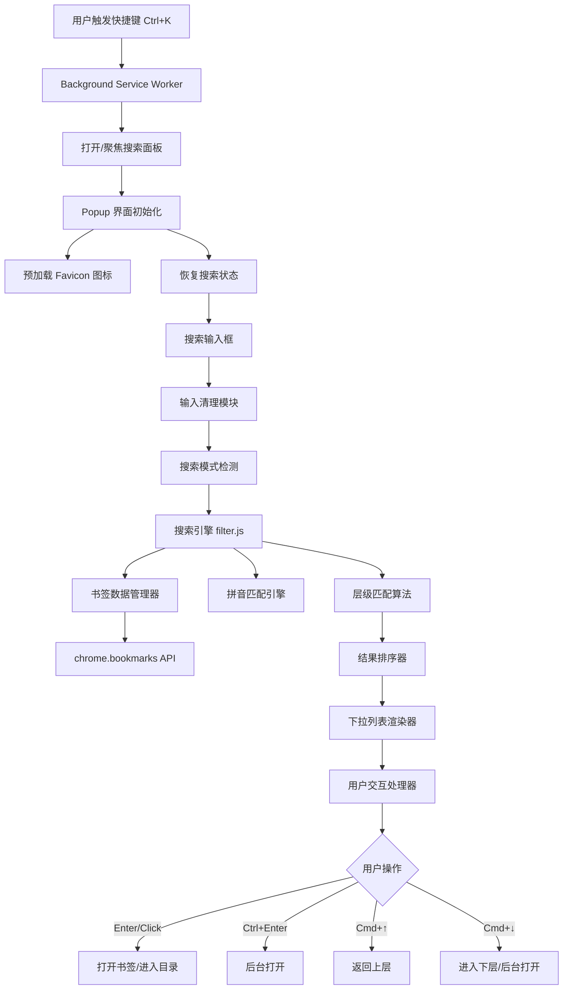

# Marsunso - 书签快捷搜索插件

<div align="center">

[](https://github.com/your-username/quicker)
[](LICENSE)
[](https://www.google.com/chrome/)

一个提升浏览器书签访问效率的 Chrome 扩展程序，通过快捷键快速搜索和访问书签，让书签管理如同 macOS Spotlight 一般流畅便捷。

[功能特性](#功能特性) • [安装方法](#安装方法) • [使用指南](#使用指南) • [技术架构](#技术架构) • [开发说明](#开发说明) • [贡献指南](#贡献指南)

</div>

---

## 项目简介

Marsunso 是一个轻量级的 Chrome 书签快捷搜索插件，旨在解决传统书签管理的效率问题。通过类似 macOS Spotlight 的交互体验，用户可以快速搜索、导航和访问书签，无需在书签栏中逐层点击。

### 核心优势

- **极速访问**：`Ctrl+K` / `Command+K` 一键唤起，无需鼠标操作
- **智能搜索**：支持书签名称、URL、拼音匹配，多种搜索模式自动切换
- **层级导航**：支持多级路径搜索和精确路径导航
- **无缝体验**：50ms 防抖优化，状态自动保存，焦点智能管理
- **隐私安全**：所有数据本地处理，不上传任何信息

## 功能特性

### 🚀 快捷键唤起

- **全局快捷键**：`Ctrl+K` (Windows/Linux) 或 `Command+K` (macOS)
- **智能聚焦**：面板已打开时重复按快捷键自动聚焦搜索框
- **状态保存**：关闭面板后 1.5 秒内重新打开，自动恢复搜索内容

### 🔍 智能搜索引擎

- **多模式自动切换**：
  - **默认模式**：展示所有二级书签
  - **模糊搜索**：支持书签名称、URL、拼音匹配
  - **路径导航**：使用 `/` 开头精确导航到指定目录

- **拼音匹配**：基于 `pinyin-pro` 库，支持：
  - 全拼匹配：`woaixuexi` → "我爱学习"
  - 首字母匹配：`wxxx` → "我爱学习"
  - 混合匹配：`w学xi` → "我爱学习"
  - 非连续匹配：`我学` → "我爱学习"
  - 多音字、生僻字支持

- **层级匹配**：支持多关键词搜索，如 `学习 读书` 在"学习"目录下搜索"读书"

### 📁 层级导航

- **精确路径导航**：`/学习/课程` 直接进入指定目录
- **路径搜索混合**：`/学习/课程 语文` 在指定路径下搜索
- **快速返回**：`Cmd/Ctrl + ↑` 返回上一层
- **快速进入**：`Cmd/Ctrl + ↓` 进入目录或后台打开书签

### ⌨️ 完整键盘操作

- **导航**：`↑` `↓` 选择，`Cmd/Ctrl + ←` `→` 快速跳转首尾
- **打开方式**：
  - `Enter`：新标签页打开并切换（关闭面板）
  - `Ctrl+Enter`：后台打开（保持面板和搜索状态）
  - `Cmd/Ctrl + ↓`：同 `Ctrl+Enter`（键盘友好）
- **快速操作**：`Cmd/Ctrl + Backspace` 清空搜索框，`Esc` 关闭面板

### 🎨 Spotlight 风格界面

- **简洁美观**：半透明磨砂背景，圆角阴影设计
- **图标优化**：自动获取网站 Favicon，文件夹使用 SVG 图标
- **高亮提示**：选中项淡蓝色高亮，滚动自动跟随
- **性能优化**：图标预加载，DocumentFragment 批量渲染

## 安装方法

### 方式一：Chrome 网上应用店安装（推荐）

> 🚧 **开发中**：插件正在准备发布到 Chrome 网上应用店，敬请期待。

### 方式二：开发者模式安装（适合测试和开发）

1. **克隆或下载项目**：
   ```bash
   git clone https://github.com/your-username/quicker.git
   cd quicker
   ```

2. **打开 Chrome 扩展程序管理页面**：
   - 在地址栏输入 `chrome://extensions/` 并回车
   - 或通过菜单：`更多工具` → `扩展程序`

3. **启用开发者模式**：
   - 点击页面右上角的 "开发者模式" 开关

4. **加载扩展程序**：
   - 点击 "加载已解压的扩展程序" 按钮
   - 选择项目根目录（包含 `manifest.json` 的文件夹）

5. **验证安装**：
   - 扩展程序列表中出现 "Quicker - 书签快捷搜索"
   - 按 `Ctrl+K` 或 `Command+K` 测试唤起面板

### 兼容性要求

| 浏览器 | 最低版本 | 说明 |
|--------|---------|------|
| Google Chrome | 88+ | 推荐使用最新稳定版 |
| Microsoft Edge | 88+ | 基于 Chromium，完全兼容 |
| 其他 Chromium 浏览器 | 88+ | 理论兼容，建议测试验证 |

> ⚠️ **注意**：本插件使用 Manifest V3 标准，不兼容 Manifest V2 或更低版本的浏览器。

## 使用指南

### 快速上手

1. **唤起搜索面板**：按 `Ctrl+K` (Windows/Linux) 或 `Command+K` (macOS)
2. **输入关键词**：直接输入书签名称、URL 或拼音
3. **选择结果**：使用 `↑` `↓` 方向键或鼠标点击
4. **打开书签**：按 `Enter` 或点击打开
5. **关闭面板**：按 `Esc` 或点击其他区域

### 搜索模式详解

#### 模式一：默认模式（搜索框为空）

**触发条件**：搜索框内容为空或仅包含空格

**展示内容**：所有二级书签（书签栏下的直接子项，深度为 2 的项目）

**典型场景**：快速浏览常用书签分类

---

#### 模式二：模糊搜索模式

**触发条件**：搜索框包含文字，且不以 `/` 开头

**支持的匹配方式**：

| 输入示例 | 匹配规则 | 说明 |
|---------|---------|------|
| `vue` | 单关键词匹配 | 搜索书签名称或 URL 包含 "vue" 的项 |
| `wxxx` | 拼音首字母 | 匹配 "我爱学习" 等汉字 |
| `woaixuexi` | 全拼匹配 | 匹配 "我爱学习" |
| `w学xi` | 混合输入 | 拼音与汉字混合匹配 "我爱学习" |
| `我学` | 非连续匹配 | 跳跃式匹配 "我爱学习" |
| `学习 读书` | 多级搜索 | 上层匹配 "学习"，下层匹配 "读书" |
| `学习 读书 ` | 获取子项 | 获取 "读书" 目录的所有直接子项 |
| `前端 vue react` | 三级搜索 | 上层 "前端"，中层 "vue"，下层 "react" |

**匹配优先级**：
1. 完全匹配 > 前缀匹配 > 包含匹配
2. 书签名称匹配 > URL 匹配
3. 层级深度越浅优先级越高

---

#### 模式三：路径导航模式

**触发条件**：搜索框以 `/` 开头

**语法规则**：
- 必须以 `/` 开头（`/` 不能出现在任何空格之后）
- 斜杠分隔的每一段表示精确目录名称
- 可以与空格搜索混合使用

**示例**：

| 输入内容 | 匹配效果 |
|---------|----------|
| `/学习/课程` | 精确进入 "学习" → "课程" 目录 |
| `/学习/课程 语文` | 在 "课程" 目录下模糊搜索 "语文" |
| `/学习/课程/` | 末尾斜杠，展示 "课程" 目录的所有子项 |
| `学习/课程` | ❌ 无效（未以 `/` 开头） |
| `学习 /课程` | ❌ 无效（`/` 在空格后） |

---

### 键盘操作完整列表

| 按键 | 功能 | 详细说明 |
|------|------|----------|
| `Ctrl+K` / `Command+K` | 打开搜索面板 | 全局快捷键，任意页面可触发 |
| `↑` | 向上选择 | 循环选择，第一项向上到最后一项 |
| `↓` | 向下选择 | 循环选择，最后一项向下到第一项 |
| `Cmd/Ctrl + ←` | 跳转到第一项 | 快速定位到列表首项 |
| `Cmd/Ctrl + →` | 跳转到最后一项 | 快速定位到列表末项 |
| `Enter` | 确认操作 | 目录：进入；书签：新标签页打开并切换，关闭面板 |
| `Ctrl/Cmd + Enter` | 后台打开 | 书签在后台打开，停留当前页面，保持面板 |
| `Cmd/Ctrl + ↑` | 返回上层 | 删除最后一个路径段，触发搜索更新 |
| `Cmd/Ctrl + ↓` | 进入/后台打开 | 目录：进入；书签：后台打开 |
| `Cmd/Ctrl + Backspace` | 清空搜索框 | 快速清空，触发默认模式 |
| `Esc` | 关闭面板 | 关闭搜索面板，保存当前状态 |

> **💡 提示**：Mac 系统使用 `Command` 键，Windows/Linux 使用 `Ctrl` 键。

---

### 鼠标操作

| 操作 | 效果 |
|------|------|
| **单击书签** | 新标签页打开并切换，关闭面板 |
| **Ctrl + 单击书签** | 后台打开，保持当前页面和面板 |
| **单击文件夹** | 进入该文件夹，更新搜索框为完整路径 |
| **Ctrl + 单击文件夹** | 同单击（文件夹不支持后台打开） |

---

### 高级技巧

**批量打开书签**：
1. 使用 `Ctrl+Enter` 或 `Ctrl+单击` 后台打开第一个书签
2. 面板保持打开，搜索内容不变
3. 继续点击其他书签，实现快速批量打开

**快速定位**：
- 使用 `Cmd/Ctrl + ←` 和 `Cmd/Ctrl + →` 在长列表中快速跳转首尾
- 使用 `Cmd/Ctrl + ↑` 逐层返回上级目录

**状态保存**：
- 关闭面板后 2 秒内重新打开，自动恢复上次的搜索内容
- 适合快速查找、临时关闭、再次查找的场景

## 技术架构

### 技术选型

| 技术项 | 方案 | 说明 |
|--------|------|------|
| **Manifest 版本** | V3 | Chrome 插件最新标准，向后兼容性更好 |
| **核心语言** | 原生 JavaScript (ES6+) | 轻量级，无框架依赖 |
| **UI 框架** | HTML + CSS | 简洁高效的界面构建 |
| **书签 API** | `chrome.bookmarks` | Chrome 提供的书签访问接口 |
| **标签页 API** | `chrome.tabs` | 标签页创建和管理 |
| **存储 API** | `chrome.storage.local` | 搜索状态缓存（2秒有效期） |
| **快捷键 API** | `chrome.commands` | 全局快捷键监听 |
| **拼音处理** | `pinyin-pro` 第三方库 | 支持多音字、生僻字、全拼、首字母匹配 |
| **图标服务** | Google Favicon API | 网站图标获取服务 |

### 架构组件



### 模块职责

| 模块 | 文件 | 核心职责 |
|------|------|----------|
| **配置清单** | `manifest.json` | 定义插件元信息、权限、快捷键、入口页面 |
| **后台服务** | `background.js` | 监听快捷键事件、管理面板状态、处理搜索状态保存/恢复消息 |
| **界面结构** | `popup.html` | 定义搜索面板的 DOM 结构 |
| **界面交互** | `popup.js` | 处理用户输入、键盘事件、界面更新、焦点管理、状态保存 |
| **搜索引擎** | `filter.js` | 搜索模式检测、拼音匹配、层级匹配、结果排序、输入清理 |
| **书签管理** | `bookmarkManager.js` | 书签数据获取、树形结构处理、路径生成、拼音预处理、缓存管理 |
| **拼音工具** | `pinyinUtil.js` | 汉字拼音转换、5种拼音匹配算法、混合输入处理、智能分段 |
| **配置管理** | `config.js` | 常量定义、配置项管理 |
| **样式表** | `popup.css` | Spotlight 风格的视觉样式 |

### 项目结构

```
Quicker/
├── manifest.json                  # 扩展配置清单（Manifest V3）
├── popup.html                    # 搜索面板界面结构
├── popup.css                     # 样式表（Spotlight 风格）
├── popup.js                      # 主交互逻辑（815行）
├── background.js                 # 后台服务（状态保存/恢复）
├── scripts/
│   ├── bookmarkManager.js        # 书签数据管理（244行）
│   ├── filter.js                 # 搜索引擎核心（629行）
│   ├── pinyinUtil.js             # 拼音工具（750行）
│   ├── config.js                 # 配置管理（107行）
│   └── pinyin-pro.js             # 第三方拼音库（~336KB）
├── tests/
│   ├── test-navigate-up.js       # 路径回退算法测试
│   ├── test-hierarchy-matching.js # 层级匹配算法测试
│   ├── test-pinyin-matching.js   # 拼音匹配算法测试
│   ├── test-path-navigation.js   # 路径导航功能测试
│   ├── test-path-highlight.js    # 路径高亮功能测试
│   ├── test.js                   # 综合测试和演示脚本
│   └── README.md                 # 测试说明文档
├── images/
│   ├── icon16.png                # 16x16 图标
│   ├── icon48.png                # 48x48 图标
│   ├── icon128.png               # 128x128 图标
│   ├── folder-icon.svg           # 文件夹图标（SVG）
│   └── bookmark-icon.svg         # 默认书签图标（SVG）
├── .qoder/
│   └── quests/
│       └── bookmark-shortcut-search-extension.md  # 技术设计文档
└── README.md                     # 项目说明文档
```

### 核心算法

**1. 搜索模式检测**（`detectSearchMode()`）：
- 默认模式：搜索框为空
- 路径导航模式：以 `/` 开头且不含空格后的 `/`
- 模糊搜索模式：其他情况

**2. 层级匹配算法**（`matchPathHierarchy()`）：
- 分层独立匹配策略，每层使用完整的拼音匹配算法
- 支持跳层匹配（关键词数量 < 路径层级）
- 权重计算：距离书签越近的层级权重越高（0.7 ~ 1.0）
- 评分公式：`layerScore = bestMatch.score * weightFactor + baseScore(20)`

**3. 拼音匹配算法**（`matchPinyin()`）：
- 全拼匹配：`woaixuexi` → "我爱学习"
- 首字母匹配：`wxxx` → "我爱学习"
- 顺序匹配：允许跳过字符的序列匹配
- 非连续汉字匹配：`我学` → "我爱学习"
- 混合输入匹配：`w学xi` → "我爱学习"（智能分段识别）

**4. 评分排序**（`matchAndScore()`, `matchHierarchy()`）：
- 单关键词：`matchScore = match.score * 0.5 + depthScore`
- 多关键词：`matchScore = titleScore * 0.5 + pathTotalScore + depthScore`
- 深度分数：`Math.max(0, 10 - depth)`（越浅优先级越高）

### 性能优化

| 优化措施 | 实现方式 | 效果 |
|---------|---------|------|
| **防抖处理** | 输入延迟 50ms 触发搜索 | 减少不必要计算 |
| **数据缓存** | 内存缓存书签树、拼音数据、图标 URL | 避免重复获取 |
| **图标预加载** | 面板打开时后台预加载所有 Favicon | 消除图标加载延迟 |
| **路径拼音预生成** | 预处理时生成每层路径的拼音数据 | 避免匹配时重复计算 |
| **结果数量限制** | 最多返回 15 条 | 减少 DOM 渲染负担 |
| **DocumentFragment** | 批量插入 DOM 节点 | 减少重排次数 |
| **事件委托** | 列表容器监听事件 | 减少事件监听器数量 |
| **状态保存** | 2秒缓存搜索状态 | 快速恢复，提升体验 |

## 开发说明

### 本地开发环境

**环境要求**：
- Node.js（可选，用于代码格式化和检查）
- Chrome 88+ 或 Edge 88+
- 代码编辑器（推荐 VS Code）

**开发步骤**：

1. **克隆项目**：
   ```bash
   git clone https://github.com/your-username/quicker.git
   cd quicker
   ```

2. **加载扩展**：
   - 打开 Chrome 扩展程序管理页面 `chrome://extensions/`
   - 启用 "开发者模式"
   - 点击 "加载已解压的扩展程序"
   - 选择项目根目录

3. **开发调试**：
   - 修改代码后，点击扩展程序卡片上的 "刷新" 图标
   - 对于 `popup.js`、`popup.html`、`popup.css`：关闭并重新打开面板即可
   - 对于 `background.js`：需点击 "刷新" 按钮重新加载
   - 使用 Chrome DevTools 调试：
     - Popup 页面：右键点击插件图标 → "检查弹出内容"
     - Background：扩展管理页面 → "Service Worker" → "检查视图"

4. **查看日志**：
   - Popup 日志：DevTools Console
   - Background 日志：Service Worker 的 Console
   - 错误提示：扩展管理页面会显示错误信息

### 代码规范

- **JavaScript**：使用 ES6+ 语法，优先使用 `const` 和 `let`
- **命名规范**：
  - 变量/函数：小驼峰命名 `camelCase`
  - 常量：大写下划线 `UPPER_CASE`
  - 类：大驼峰命名 `PascalCase`
- **注释规范**：关键函数添加注释说明功能、参数、返回值
- **代码格式**：建议使用 Prettier 格式化代码

### 构建与打包

**打包发布版本**：

1. **清理开发文件**（可选）：
   ```bash
   # 删除 .qoder 等开发辅助目录
   rm -rf .qoder .git
   ```

2. **创建 ZIP 包**：
   ```bash
   # 在项目根目录执行
   zip -r quicker-v1.0.2.zip . -x "*.git*" "*.DS_Store" "node_modules/*"
   ```

3. **上传到 Chrome 网上应用店**：
   - 访问 [Chrome Web Store Developer Dashboard](https://chrome.google.com/webstore/devconsole)
   - 上传 ZIP 包
   - 填写商店信息、截图、隐私政策等
   - 提交审核

### 测试清单

**功能测试**：
- [ ] 快捷键唤起（`Ctrl+K` / `Command+K`）
- [ ] 默认模式展示二级书签
- [ ] 模糊搜索（单关键词、多关键词）
- [ ] 拼音匹配（全拼、首字母、混合、非连续）
- [ ] 路径导航（精确路径、路径搜索）
- [ ] 键盘操作（上下选择、快速跳转、返回上层、进入目录）
- [ ] 书签打开（Enter、Ctrl+Enter、鼠标点击）
- [ ] 图标显示（文件夹、Favicon、降级方案）
- [ ] 状态保存与恢复（2秒缓存）
- [ ] 焦点管理（自动聚焦、进入目录后恢复）

**性能测试**：
- [ ] 大量书签（1000+）首次加载 < 500ms
- [ ] 搜索响应时间 < 200ms
- [ ] 界面滚动流畅（60fps）
- [ ] 内存占用 < 20MB

**兼容性测试**：
- [ ] macOS + Chrome
- [ ] macOS + Edge
- [ ] Windows + Chrome
- [ ] Windows + Edge

### 自动化测试

项目包含完整的测试套件，位于 `tests/` 目录。详细信息请参考 [tests/README.md](tests/README.md)。

**单元测试**：

```bash
# 测试路径回退算法
node tests/test-navigate-up.js

# 其他测试需在浏览器控制台运行
```

**集成测试**：

在浏览器控制台运行综合测试：

```javascript
// 在 popup.html 中添加 <script src="tests/test.js"></script>
// 然后在控制台运行：
QuickerTest.runAllTests();         // 运行所有测试
QuickerTest.testSearchEngine();    // 测试搜索引擎
QuickerTest.performanceTest();     // 性能测试
```

**测试覆盖范围**：
- ✅ 路径回退算法 (navigateUp)
- ✅ 层级匹配算法 (matchHierarchy)
- ✅ 拼音匹配算法 (matchPinyin)
- ✅ 路径导航功能
- ✅ 路径高亮功能
- ✅ 书签管理模块
- ✅ 搜索引擎模块
- ✅ 配置管理模块

### 已完成功能

- ✅ 快捷键唤起（全局 `Ctrl+K` / `Command+K`）
- ✅ 三种搜索模式（默认、模糊、路径导航）
- ✅ 完整拼音匹配（基于 `pinyin-pro` 库）
- ✅ 层级匹配算法（多关键词搜索）
- ✅ 键盘完整操作（导航、打开、返回、清空）
- ✅ 状态保存与恢复（2秒缓存）
- ✅ Spotlight 风格界面
- ✅ 图标预加载与缓存
- ✅ 防抖优化（50ms）
- ✅ 安全防护（输入清理、危险字符过滤）

### 扩展功能规划

以下功能可根据用户反馈和需求优先级逐步实现：

- ⏳ **搜索历史记录**：扩展搜索范围，支持浏览历史快速访问
- ⏳ **主题切换**：支持浅色/深色主题，适应不同使用环境
- ⏳ **自定义配置**：快捷键、最大显示数量、搜索延迟等
- ⏳ **云同步配置**：使用 `chrome.storage.sync` 同步用户设置
- ⏳ **书签失效检测**：定期检查 URL 可访问性，标记失效书签
- ⏳ **搜索打开的标签页**：统一搜索入口，管理已打开标签
- ⏳ **自定义搜索引擎**：支持特殊前缀调用外部搜索（如 `g: 关键词`）
- ⏳ **虚拟滚动**：应对超大量书签的性能优化

## 贡献指南

我们欢迎任何形式的贡献，包括但不限于：

- 🐛 **报告 Bug**：在 [Issues](https://github.com/your-username/quicker/issues) 页面提交问题
- 💡 **功能建议**：提出新功能或改进建议
- 📝 **文档改进**：修正文档错误或补充说明
- 🔧 **代码贡献**：提交 Pull Request 修复 Bug 或添加功能

### 提交 Issue

在提交 Issue 之前，请确保：

1. **搜索现有 Issue**：避免重复提交
2. **提供详细信息**：
   - 问题描述（期望行为 vs 实际行为）
   - 复现步骤
   - 浏览器版本和操作系统
   - 截图或错误日志（如有）

### 提交 Pull Request

1. **Fork 项目**：点击右上角 Fork 按钮
2. **创建分支**：
   ```bash
   git checkout -b feature/your-feature-name
   # 或
   git checkout -b fix/your-bug-fix
   ```
3. **编写代码**：遵循项目代码规范
4. **测试验证**：确保功能正常，无新增 Bug
5. **提交变更**：
   ```bash
   git add .
   git commit -m "feat: 添加某某功能" # 或 "fix: 修复某某问题"
   git push origin feature/your-feature-name
   ```
6. **创建 PR**：在 GitHub 页面创建 Pull Request，详细描述变更内容

**Commit 消息规范**：
- `feat:` 新功能
- `fix:` 修复 Bug
- `docs:` 文档更新
- `style:` 代码格式调整（不影响功能）
- `refactor:` 代码重构
- `perf:` 性能优化
- `test:` 测试相关
- `chore:` 构建工具或辅助工具变动

### 行为准则

- 尊重他人，友善交流
- 遵守开源社区规范
- 专注于技术讨论，避免无关话题

## 常见问题

### Q1: 快捷键不生效？

**A**: 检查以下几点：
1. 扩展是否正确加载（`chrome://extensions/` 查看状态）
2. 快捷键是否与其他扩展冲突（`chrome://extensions/shortcuts` 查看）
3. 某些特殊页面（`chrome://`、`chrome-extension://`）不支持扩展快捷键

### Q2: 拼音搜索不准确？

**A**: 拼音匹配支持多种模式，尝试以下输入方式：
- 全拼：`woaixuexi`
- 首字母：`wxxx`
- 混合：`w爱xi`
- 非连续：`我学`

### Q3: 图标显示异常？

**A**: 
1. Favicon 依赖 Google 服务，确保网络畅通
2. 某些网站可能没有 Favicon，会显示默认书签图标
3. 图标加载失败会自动降级到默认图标

### Q4: 如何清除缓存？

**A**: 
1. 关闭所有插件面板
2. 在扩展管理页面点击 "刷新" 按钮
3. 重新打开面板，缓存将重新构建

### Q5: 支持其他浏览器吗？

**A**: 理论上支持所有基于 Chromium 88+ 的浏览器（如 Edge、Brave、Opera），但建议测试验证。暂不支持 Firefox（需要适配 WebExtensions API）。

## 隐私与安全

**本插件承诺**：
- ✅ 所有数据仅在本地处理，不上传到任何服务器
- ✅ 不收集用户浏览记录或书签内容
- ✅ 不使用第三方统计或分析服务
- ✅ 不注入任何跟踪代码到网页
- ✅ 图标获取仅发送域名信息（不含完整 URL）
- ✅ 输入内容自动过滤危险字符，防止 XSS 攻击

**权限说明**：
- `bookmarks`：读取书签数据，用于搜索功能
- `tabs`：打开和管理标签页
- `storage`：本地存储搜索状态（2秒缓存）

## 许可证

本项目采用 [MIT License](LICENSE) 开源协议。

```
MIT License

Copyright (c) 2024 Quicker Contributors

Permission is hereby granted, free of charge, to any person obtaining a copy
of this software and associated documentation files (the "Software"), to deal
in the Software without restriction, including without limitation the rights
to use, copy, modify, merge, publish, distribute, sublicense, and/or sell
copies of the Software, and to permit persons to whom the Software is
furnished to do so, subject to the following conditions:

The above copyright notice and this permission notice shall be included in all
copies or substantial portions of the Software.

THE SOFTWARE IS PROVIDED "AS IS", WITHOUT WARRANTY OF ANY KIND, EXPRESS OR
IMPLIED, INCLUDING BUT NOT LIMITED TO THE WARRANTIES OF MERCHANTABILITY,
FITNESS FOR A PARTICULAR PURPOSE AND NONINFRINGEMENT. IN NO EVENT SHALL THE
AUTHORS OR COPYRIGHT HOLDERS BE LIABLE FOR ANY CLAIM, DAMAGES OR OTHER
LIABILITY, WHETHER IN AN ACTION OF CONTRACT, TORT OR OTHERWISE, ARISING FROM,
OUT OF OR IN CONNECTION WITH THE SOFTWARE OR THE USE OR OTHER DEALINGS IN THE
SOFTWARE.
```

---

## 鸣谢

感谢以下开源项目和服务：

- [pinyin-pro](https://github.com/zh-lx/pinyin-pro) - 强大的汉字拼音转换库
- [Google Favicon API](https://www.google.com/s2/favicons) - 网站图标服务
- Chrome Extensions API - 提供强大的浏览器扩展能力

---

<div align="center">

**如果这个项目对你有帮助，欢迎 Star ⭐️ 支持！**

[报告问题](https://github.com/your-username/quicker/issues) • [功能建议](https://github.com/your-username/quicker/issues) • [贡献代码](https://github.com/your-username/quicker/pulls)

Made with ❤️ by Quicker Contributors

</div>
